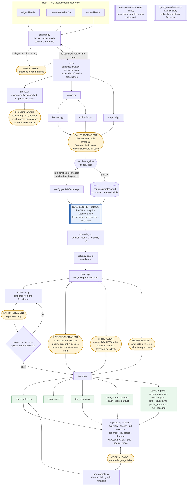

# Solution diagram

Data → metrics → roles → interface, with the agent crew where it actually sits:
**agents run the investigation, the rule engine is the adjudicator.**

## The contract in one line

**Agents decide what to examine and what the thresholds should be. The rule
engine decides what the role is.**

That is what lets this be an agentic system without producing "a role without an
explainable rule", which the case brief (§9) disqualifies. The jury still gets a
formal gate — `in_deg >= 5` — and can still be told in under a minute why any
gid got its role. What the crew adds is *the written reasoning for the 5*, a
case dossier, and a standing counter-argument.

| Agent | Decides | Guardrail |
|---|---|---|
| **planner** | which passes run on this dataset, and how deep | hard cap in config it cannot exceed |
| **calibrator** | every role threshold | must stay in a percentile-derived range; proposal is simulated and rejected if it empties a role or hands one half the graph; result is persisted so runs reproduce |
| **investigator** | what to look at around a priority account | every claim must come from a tool call; cited gids must exist |
| **critic** | what is *wrong* with the shortlist | may only cite accounts it was shown; cannot demote anything |
| **narrator** | wording | every number must appear in the RuleTrace |
| **ingest** | which column is which | re-validated against the data |
| **reviewer** | how to phrase the data requests | the gaps themselves are computed |
| **analyst** | which graph query answers a question | answers only from tool output; transcript shown |

**None of them can assign a role, a score, a cluster or a rank.** Every one has
a deterministic fallback, so `MONEYGRAPH_NO_LLM=1 python run.py` produces the
same three CSVs from the `config.yaml` thresholds.
